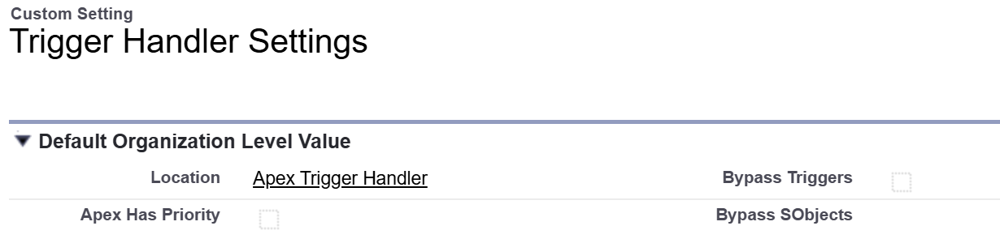
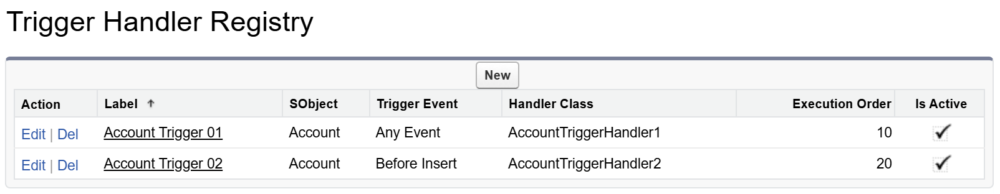

# Apex Trigger Handler

  

The Salesforce Apex trigger framework for clean, scalable, and maintainable automation.

### Features

1. Custom settings to turn triggers on and off either globally or by specific sObjects.
2. Custom registry to register handlers via settings instead of code.
3. Control flow of handler execution with `context.next()`, `context.stop()`, and `context.skips`.

| Environment           | Installation Link                                                                                                                                         | Version |
| --------------------- | --------------------------------------------------------------------------------------------------------------------------------------------------------- | ------- |
| Production, Developer | <a target="_blank" href="https://login.salesforce.com/packaging/installPackage.apexp?p0=04t2v000007CfgQAAS"></a> | ver 2.0 |
| Sandbox               | <a target="_blank" href="https://test.salesforce.com/packaging/installPackage.apexp?p0=04t2v000007CfgQAAS"></a>  | ver 2.0 |

### v2.0 Release Notes

- Support custom metadata type settings to register trigger handlers. ([jump to section](#12-bind-with-handler-settings))
- **Improve Consistency** (v1.2.1): Ids returned by `props.filterChangedAny` and `props.filterChangedAll` are now in the same Id orders of `props.newList`.

## Table of Contents

- [1. Setting](#1-setting)
- [2. Handler](#2-handler)
- [3. Execution Control](#3-execution-control)
- [4. Tests](#4-tests)
- [5. APIs](#5-apis)
- [6. License](#6-license)

## 1. Setting

### 1.1 Custom Setting



The `Registry Has Priority` setting determines whether handlers registered via custom metadata types take precedence over those registered directly in Apex code. For more details about bypass flags, see the table below:

| Bypass Triggers | Bypass SObjects                       | Description                                                          |
| --------------- | ------------------------------------- | -------------------------------------------------------------------- |
| false           | Empty                                 | By default, no trigger handlers are bypassed.                        |
| true            | Empty                                 | All trigger handlers registered through this framework are bypassed. |
| true            | Account<br />Contact<br />Opportunity | Only trigger handlers for the specified SObjects are bypassed.       |

### 1.2 Custom Metadata



| Field Name      | Data Type | Description                                                                                                       |
| --------------- | --------- | ----------------------------------------------------------------------------------------------------------------- |
| SObject         | Text      | **Required.** The API name of the SObject to which the handler applies.                                           |
| Trigger Event   | Picklist  | **Required.** Defaults to `Any Event`. When set to `Any Event`, the handler is applied to all implemented events. |
| Handler Class   | Text      | **Required.** The name of the Apex class that implements the handler logic.                                       |
| Execution Order | Number    | **Required.** Determines the sequence in which handlers are executed.                                             |
| Is Active       | Checkbox  | Indicates whether the handler is enabled or disabled.                                                             |

## 2. Handler

### 2.1 Implementation

To create a trigger handler, define a class that implements the corresponding handler interfaces.

```java
// Explicitly declare the required interfaces for clarity.
public class AccountTriggerHandler implements Triggers.BeforeInsert, Triggers.BeforeUpdate {
    // Implement Triggers.BeforeInsert
    public void beforeInsert(Triggers.Context context) {
    }

    // Implement Triggers.BeforeUpdate
    public void beforeUpdate(Triggers.Context context) {
    }
}
```

### 2.2 Registering with Registry

Handlers registered via the registry are loaded automatically. Each handler is associated with the correct SObject and trigger event based on its configuration.


```java
trigger AccountTrigger on Account (before update, after update) {
    Triggers.prepare().execute();
}
```

### 2.3 Registering with Apex

Handlers can be registered using either class types or class names. Using class names is often preferred for flexibility. You can bind handlers to all events for simpler control, or to specific events for more granular management.

```java
trigger AccountTrigger on Account (before update, after update) {
    Triggers.prepare()
        .bind(AccountTriggerHandler1.class) // handlers bound to any event
        .bind('AccountTriggerHandler2')
        .beforeUpdate()                     // handlers bound to a specific event
        .bind(AccountTriggerHandler3.class)
        .bind('AccountTriggerHandler4')
        .execute();
}
```

**Note:** You can register trigger handlers using both custom metadata and Apex code at the same time. By default, handlers registered in Apex code have higher priority. To give priority to handlers registered via custom metadata, enable the `Registry Has Priority` setting as described above.

### 2.4 Props

All static properties from the `Trigger` class are now accessible via the `context` object. Always use `context` to access trigger properties, such as `context.oldList` and `context.newList`.

```java
public class AccountTriggerHandler implements Triggers.BeforeInsert {
    public void beforeInsert(Triggers.Context context) {
        if (context.isBefore && context.isInsert) {
            for (Account account : (List<Account>) context.newList) {
                // Your logic here
            }
        }
    }
}
```

### 2.5 States

Use `Triggers.states` to manage state objects. This is a singleton, meaning it is shared across all triggers within the same transaction. State classes are automatically initialized the first time they are accessed.

```java
public class AccountTriggerHandler implements Triggers.BeforeInsert {
    public void beforeInsert(Triggers.Context context) {
        // Retrieve and update a state instance as needed.
        CounterState counter = (CounterState) Triggers.states.get(CounterState.class);
        counter.increase();
    }
}
```

You can also set a state object in advance, which is useful for initializing values:

```java
// Make sure to check if the state already exists.`
if (!Triggers.states.contains(CounterState.class)) {
    Triggers.states.put(CounterState.class, new CounterState(100));
}
```

State classes must implement the `Triggers.State` interface.

```java
public class CounterState implements Triggers.State {
    public Integer count { get; private set; }
    
    public CounterState() {
        this.count = 0;
    }
    
    public CounterState(Integer count) {
        this.count = count;
    }
    
    public void increase() {
        this.count++;
    }
}
```

You can also remove state objects to free up resources:

```java
// Remove a specific state.
Triggers.states.remove(CounterState.class);
// Or clear all states.
Triggers.states.clear();
```

## 3. Execution Control

### 3.1 Skipping Handlers

You can skip specific handlers in your Apex code as shown below:

```java
// Skip the AccountTriggerHandler during this operation.
Triggers.skips.add(AccountTriggerHandler.class);
insert accounts;
// Restore the handler after the operation.
Triggers.skips.remove(AccountTriggerHandler.class);
// Or simply clear all skipped handlers.
Triggers.skips.clear();
```

### 3.2 Handler Flow Control

```java
public class AccountTriggerHandler implements Triggers.BeforeInsert {
    public void beforeInsert(Triggers.Context context) {
        // Optionally call context.next() to execute all subsequent handlers.
        context.next();
        // This is useful if you need to perform logic after all subsequent handlers run.

        // Optionally call context.stop() to prevent any further handlers from executing.
        context.stop();
    }
}
```

### 3.3 Error Handling

You can centralize exception handling for all subsequent handlers by implementing a dedicated error handler. This ensures that any exceptions thrown by handlers executed after `context.next()` are caught and managed in a single location. For example:

```java
public class ErrorTriggerHandler implements Triggers.BeforeInsert, Triggers.AfterInsert {
    public void beforeInsert(Triggers.Context context) {
		execute(context);
    }

    public void afterInsert(Triggers.Context context) {
		execute(context);
    }

    private void execute(Triggers.Context context) {
        try {
            context.next();
        } catch (Exception ex) {
            // Handle exceptions from subsequent handlers here
            // rethrow to abort the transaction
            throw ex;
        }
    }
}
```

## 4. Tests

### 4.1 Test with Mockup Data

The following method is private but `@TestVisible`, it can be used in test methods to supply mockup records for old and new lists. So we don't need to perform DMLs to trigger the handlers.

```java
@isTest
static void test_AccountTriggerHandler_BeforeUpdate {
    List<SObject> oldList = new List<Account> {
        new Account(Id = TriggersTest.getFakeId(Account.SObjectType, 1), Name = 'Old Name 1'),
        new Account(Id = TriggersTest.getFakeId(Account.SObjectType, 2), Name = 'Old Name 2'),
        new Account(Id = TriggersTest.getFakeId(Account.SObjectType, 3), Name = 'Old Name 3')}

    List<SObject> newList = new List<Account> {
        new Account(Id = TriggersTest.getFakeId(Account.SObjectType, 1), Name = 'New Name 1'),
        new Account(Id = TriggersTest.getFakeId(Account.SObjectType, 2), Name = 'New Name 2'),
        new Account(Id = TriggersTest.getFakeId(Account.SObjectType, 3), Name = 'New Name 3')}

    Triggers.prepare(TriggerOperation.Before_Update, oldList, newList)
        .beforeUpdate().bind(new MyAccountHandler()).execute();
}
```

### 4.2 Test with Mockup Library

The following demo is using [Apex Test Kit](https://github.com/apexfarm/ApexTestKit) as a mockup data library. The behavior will be the same as the above example, but a sophisticated mock data library can also generate mockup data with read-only fields, such as formula fields, roll-up summary fields and system fields.

```java
@isTest
static void test_AccountTriggerHandler_BeforeUpdate {
    // automatically generate fake IDs for oldList
    List<SObject> oldList = ATK.prepare(Account.SObjectType, 3)
        .field(Account.Name).index('Old Name {0}')
        .mock().get(Account.SObjectType);

    // IDs in oldList will be preserved in the newList
    List<SObject> newList = ATK.prepare(Account.SObjectType, oldList)
        .field(Account.Name).index('New Name {0}')
        .mock().get(Account.SObjectType);

    Triggers.prepare(TriggerOperation.Before_Update, oldList, newList)
        .beforeUpdate().bind(new MyAccountHandler()).execute();
}
```

## 5. APIs

### 5.1 Trigger Handler Interfaces

| Interface               | Method to Implement                                |
| ----------------------- | -------------------------------------------------- |
| Triggers.Handler        | `Boolean shouldExecute(Triggers.Context context);` |
| Triggers.BeforeInsert   | `void beforeInsert(Triggers.Context context);`     |
| Triggers.AfterInsert    | `void afterInsert(Triggers.Context context);`      |
| Triggers.BeforeUpdate   | `void beforeUpdate(Triggers.Context context);`     |
| Triggers.AfterUpdate    | `void afterUpdate(Triggers.Context context);`      |
| Triggers.BeforeDelete   | `void beforeDelete(Triggers.Context context);`     |
| Triggers.AfterDelete    | `void afterDelete(Triggers.Context context);`      |
| Triggers.BeforeUndelete | `void afterUndelete(Triggers.Context context);`    |

### 5.2 Triggers.Context

| Property/Method | Type                | Description                                                                                                                                                                                 |
| --------------- | ------------------- | ------------------------------------------------------------------------------------------------------------------------------------------------------------------------------------------- |
| context.props   | Triggers.Props      | All properties on Trigger are exposed by this class. In addition there are frequently used helper methods and a convinient sObjectType property, in case reflection is needed .             |
| context.state   | Map<Object, Object> | A map provided for developers to pass any value down to other handlers.                                                                                                                     |
| context.skips   | Triggers.Skips      | A set to store handlers to be skipped. Call the following methods to manage skips: `context.skips.add()`, `context.skips.remove()`, `context.skips.clear()` `context.skips.contains()` etc. |
| context.next()  | void                | Call the next handler.                                                                                                                                                                      |
| context.stop()  | void                | Stop execute any following handlers. A bit like the the stop in process builders.                                                                                                           |

### 5.3 Triggers.Props

#### Properties

| Property      | Type               | Description              |
| ------------- | ------------------ | ------------------------ |
| sObjectType   | SObjectType        | The current SObjectType. |
| isExecuting   | Boolean            | Trigger.isExecuting      |
| isBefore      | Boolean            | Trigger.isBefore         |
| isAfter       | Boolean            | Trigger.isAfter          |
| isInsert      | Boolean            | Trigger.isInsert         |
| isUpdate      | Boolean            | Trigger.isUpdate         |
| isDelete      | Boolean            | Trigger.isDelete         |
| isUndelete    | Boolean            | Trigger.isUndelete       |
| oldList       | List\<SObject\>    | Trigger.old              |
| oldMap        | Map\<Id, SObject\> | Trigger.oldMap           |
| newList       | List\<SObject\>    | Trigger.new              |
| newMap        | Map\<Id, SObject\> | Trigger.newMap           |
| operationType | TriggerOperation   | Trigger.operationType    |
| size          | Integer            | Trigger.size             |

#### Methods

**Note**: the following `isChanged` method has the same behavior has the `ISCHANGED` formula:

> - This function returns `false` when evaluating any field on a newly created record.
> - If a text field was previously blank, this function returns `true` when it contains any value.
> - For number, percent, or currency fields, this function returns `true` when:
>   - The field was blank and now contains any value
>   - The field was zero and now is blank
>   - The field was zero and now contains any other value

| Method                                                                                                                                                                                                     | Type       | Description                                                                                                               |
| ---------------------------------------------------------------------------------------------------------------------------------------------------------------------------------------------------------- | ---------- | ------------------------------------------------------------------------------------------------------------------------- |
| - `isChanged(SObjectField field1)`                                                                                                                                                                         | Boolean    | Check if any record has a field changed during an update.                                                                 |
| - `isChangedAny(SObjectField field1, SObjectField field2)`<br>- `isChangedAny(SObjectField field1, SObjectField field2, SObjectField field3)`<br>- `isChangedAny(List<SObjectField> fields)`               | Boolean    | Check if any record has multiple fields changed during an update. Return `true` if any specified field is changed.        |
| - `isChangedAll(SObjectField field1, SObjectField field2)`<br>- `isChangedAll(SObjectField field1, SObjectField field2, SObjectField field3)`<br>- `isChangedAll(List<SObjectField> fields)`               | Boolean    | Check if any record has multiple fields changed during an update. Return `true` only if all specified fields are changed. |
| - `filterChanged(SObjectField field1)`                                                                                                                                                                     | List\<Id\> | Filter IDs of records have a field changed during an update.                                                              |
| - `filterChangedAny(SObjectField field1, SObjectField field2)`<br/>- `filterChangedAny(SObjectField field1, SObjectField field2, SObjectField field3)`<br/>- `filterChangedAny(List<SObjectField> fields)` | List\<Id\> | Filter IDs of records have multiple fields changed during an update. Return IDs if any specified field is changed.        |
| - `filterChangedAll(SObjectField field1, SObjectField field2)`<br/>- `filterChangedAll(SObjectField field1, SObjectField field2, SObjectField field3)`<br/>- `filterChangedAll(List<SObjectField> fields)` | List\<Id\> | Filter IDs of records have multiple fields changed during an update. Return IDs only if all specified fields are changed. |

## 6. License

BSD 3-Clause License
