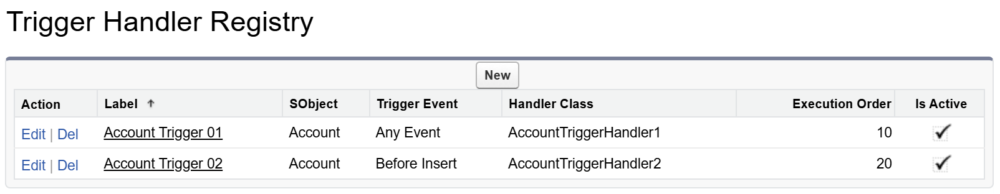

# Apex Trigger Handler

  

The Salesforce Apex trigger framework for clean, scalable, and maintainable automation.

### Features

1. Custom settings to turn triggers on and off either globally or by specific sObjects.
2. Custom registry to register handlers via settings instead of code.
3. Control flow of handler execution with `context.next()`, `context.stop()`, and `context.skips`.

| Environment           | Installation Link                                                                                                                                         | Version |
| --------------------- | --------------------------------------------------------------------------------------------------------------------------------------------------------- | ------- |
| Production, Developer | <a target="_blank" href="https://login.salesforce.com/packaging/installPackage.apexp?p0=04t2v000007CfgQAAS"></a> | ver 2.0 |
| Sandbox               | <a target="_blank" href="https://test.salesforce.com/packaging/installPackage.apexp?p0=04t2v000007CfgQAAS"></a>  | ver 2.0 |

### v2.0 Release Notes

- Support custom metadata type settings to register trigger handlers. ([jump to section](#12-bind-with-handler-settings))
- **Improve Consistency** (v1.2.1): Ids returned by `props.filterChangedAny` and `props.filterChangedAll` are now in the same Id orders of `props.newList`.

---

## Table of Contents

- [1. Setting](#1-setting)
  - [1.1 Custom Setting](#11-custom-setting)
  - [1.2 Custom Metadata](#12-custom-metadata)
- [2. Trigger](#2-trigger)
  - [2.1 Bind with Registry](#21-bind-with-registry)
  - [2.2 Bind with Apex](#22-bind-with-apex)
  - [2.3 Bind with Both](#23-bind-with-both)
- [2. Trigger Handler](#2-trigger-handler)
  - [2.1 Create Handlers](#21-create-handlers)
  - [2.2 Skip Handlers](#22-skip-handlers)
- [3. Tests](#3-tests)
  - [3.1 Test with Mockup Data](#31-test-with-mockup-data)
  - [3.2 Test with Mockup Library](#32-test-with-mockup-library)
- [4. APIs](#4-apis)
  - [4.1 Trigger Handler Interfaces](#41-trigger-handler-interfaces)
  - [4.2 Triggers.Context](#42-triggerscontext)
  - [4.3 Triggers.Props](#43-triggersprops)
- [5. License](#5-license)

## 1. Setting

### 1.1 Custom Setting


The **Apex Has Priority** setting determines whether handlers registered directly in Apex code take precedence over those registered via custom metadata types. For more information about bypass flags, refer to the table below:

| Bypass Triggers | Bypass SObjects                       | Description                                                          |
| --------------- | ------------------------------------- | -------------------------------------------------------------------- |
| false           | Empty                                 | By default, no trigger handlers are bypassed.                        |
| true            | Empty                                 | All trigger handlers registered through this framework are bypassed. |
| true            | Account<br />Contact<br />Opportunity | Only trigger handlers for the specified SObjects are bypassed.       |
| false           | Account<br />Contact<br />Opportunity | No trigger handlers are bypassed, even for the specified SObjects.   |

### 1.2 Custom Metadata



| Field Name      | Data Type | Description                                                                                                    |
| --------------- | --------- | -------------------------------------------------------------------------------------------------------------- |
| SObject         | Text      | **Required.** The API name of the SObject.                                                                     |
| Trigger Event   | Picklist  | **Required.** Defaults to `Any Event`. When set to `Any Event`, the handler is applied based on its interface. |
| Handler Class   | Text      | **Required.** The name of the Apex class implementing the handler.                                             |
| Execution Order | Number    | **Required.** Specifies the order in which handlers are executed.                                              |
| Is Active       | Checkbox  | Indicates whether the handler is enabled or disabled.                                                          |

## 2. Trigger

### 2.1 Bind with Registry

Load trigger handlers from the registry. Each handler is automatically bound to the appropriate SObject trigger event.

```java
trigger AccountTrigger on Account (before update, after update) {
    Triggers.prepare().execute();
}
```

### 2.2 Bind with Apex

Handlers can be bound using either class types or class names. Using class names is often preferred for flexibility. You can bind handlers to all events for simpler control, or to specific events for more granular management.

```java
trigger AccountTrigger on Account (before update, after update) {
    Triggers.prepare()
        .bind(AccountHandler01.class) // handlers bound to any event
        .bind('AccountHandler02')
        .beforeUpdate()               // handlers bound to a specific event
            .bind(AccountHandler03.class)
            .bind('AccountHandler04')
        .execute();
}
```

### 2.3 Bind with Both

You can register trigger handlers using both metadata and Apex code simultaneously. By default, handlers registered via metadata are loaded automatically and take precedence. If you want handlers registered in Apex code to have priority, adjust the `Apex Has Priority` setting as described above.

```java
trigger AccountTrigger on Account (before update, after update) {
    Triggers.prepare()
        .bind(AccountHandler01.class)
        .execute();
}
```

## 3. Handler

### 3.1 Create Handlers

To create a trigger handler, define a class that implements the appropriate handler interfaces. See the example below for detailed comments and tips on how to customize your trigger handler.

```java
// 1. Explicitly declare the required interfaces for clarity and maintainability.
public class MyAccountHandler implements Triggers.BeforeInsert, Triggers.BeforeUpdate {

    // 2. The "shouldExecute" method runs before any handler logic, allowing you
    // to determine if the handler should execute for the current context.
    public Boolean shouldExecute(Triggers.Context context) {
        // 3. Use helper methods to check if relevant fields have changed.
        return context.props.isChangedAny(Account.Name, Account.Description);
    }

    public void beforeInsert(Triggers.Context context) {
        handleExecute(context);
    }

    public void beforeUpdate(Triggers.Context context) {
        handleExecute(context);
    }

    private void handleUpdate(Triggers.Context context) {
        // 4. Access all trigger properties via context.props.
        // Avoid referencing Trigger.old and Trigger.new directly;
        // instead, use context.props.oldList and context.props.newList.
        if (context.props.isUpdate) {
            // 5-1. Optionally call context.next() to execute the next handler.
            // This is useful if you need to perform logic after all subsequent handlers run.
            context.next();

            // 5-2. Alternatively, call context.stop() to prevent any further handlers from executing,
            // similar to the STOP action in Process Builder.
            context.stop();
        }
    }
}
```


### 3.2 Props


### 3.3 States


```Java
public class MyAccountHandler implements Triggers.BeforeUpdate {
    public Boolean shouldExecute(Triggers.Context context) {
        return true;
    }

    public void beforeUpdate(Triggers.Context context) {
        // Retrieve and update a state instance as needed.
        CounterState state = (CounterState) context.states.get(CounterState.class);
        ++state.counter;

        // Remove unused state instances to free resources.
        context.states.remove(CounterState.class);
    }
}
```

### 3.4 Skips


```java
public class MyAccountHandler implements Triggers.BeforeUpdate {
    public Boolean shouldExecute(Triggers.Context context) {
        return true;
    }

    public void beforeUpdate(Triggers.Context context) {
        // Use context.skips to temporarily skip specific handlers.
        // Remember to restore the handler when appropriate.
        context.skips.add(ContactHandler.class);
        List<Contact> contacts = ...;
        Database.insert(contacts);
        context.skips.remove(ContactHandler.class);
    }
}
```


Global static variable `Triggers.skips` references the same `context.skips`, so you can use it to skip handlers outside of the handler contexts. For example, when you want to skip a trigger handler in a batch class:

```java
global class AccountUpdateBatch implements Database.Batchable<SObject> {
    ...
    global void execute(Database.BatchableContext BC, List<sObject> scope){
        Triggers.skips.add(MyAccountHandler.class);
        // Update accounts...
        Triggers.skips.remove(MyAccountHandler.class);
    }
    ...
}
```

## 4. Tests

### 4.1 Test with Mockup Data

The following method is private but `@TestVisible`, it can be used in test methods to supply mockup records for old and new lists. So we don't need to perform DMLs to trigger the handlers.

```java
@isTest
static void test_AccountTriggerHandler_BeforeUpdate {
    List<SObject> oldList = new List<Account> {
        new Account(Id = TriggersTest.getFakeId(Account.SObjectType, 1), Name = 'Old Name 1'),
        new Account(Id = TriggersTest.getFakeId(Account.SObjectType, 2), Name = 'Old Name 2'),
        new Account(Id = TriggersTest.getFakeId(Account.SObjectType, 3), Name = 'Old Name 3')}

    List<SObject> newList = new List<Account> {
        new Account(Id = TriggersTest.getFakeId(Account.SObjectType, 1), Name = 'New Name 1'),
        new Account(Id = TriggersTest.getFakeId(Account.SObjectType, 2), Name = 'New Name 2'),
        new Account(Id = TriggersTest.getFakeId(Account.SObjectType, 3), Name = 'New Name 3')}

    Triggers.prepare(TriggerOperation.Before_Update, oldList, newList)
        .beforeUpdate().bind(new MyAccountHandler()).execute();
}
```

### 4.2 Test with Mockup Library

The following demo is using [Apex Test Kit](https://github.com/apexfarm/ApexTestKit) as a mockup data library. The behavior will be the same as the above example, but a sophisticated mock data library can also generate mockup data with read-only fields, such as formula fields, roll-up summary fields and system fields.

```java
@isTest
static void test_AccountTriggerHandler_BeforeUpdate {
    // automatically generate fake IDs for oldList
    List<SObject> oldList = ATK.prepare(Account.SObjectType, 3)
        .field(Account.Name).index('Old Name {0}')
        .mock().get(Account.SObjectType);

    // IDs in oldList will be preserved in the newList
    List<SObject> newList = ATK.prepare(Account.SObjectType, oldList)
        .field(Account.Name).index('New Name {0}')
        .mock().get(Account.SObjectType);

    Triggers.prepare(TriggerOperation.Before_Update, oldList, newList)
        .beforeUpdate().bind(new MyAccountHandler()).execute();
}
```

## 5. APIs

### 5.1 Trigger Handler Interfaces

| Interface               | Method to Implement                                |
| ----------------------- | -------------------------------------------------- |
| Triggers.Handler        | `Boolean shouldExecute(Triggers.Context context);` |
| Triggers.BeforeInsert   | `void beforeInsert(Triggers.Context context);`     |
| Triggers.AfterInsert    | `void afterInsert(Triggers.Context context);`      |
| Triggers.BeforeUpdate   | `void beforeUpdate(Triggers.Context context);`     |
| Triggers.AfterUpdate    | `void afterUpdate(Triggers.Context context);`      |
| Triggers.BeforeDelete   | `void beforeDelete(Triggers.Context context);`     |
| Triggers.AfterDelete    | `void afterDelete(Triggers.Context context);`      |
| Triggers.BeforeUndelete | `void afterUndelete(Triggers.Context context);`    |

### 5.2 Triggers.Context

| Property/Method | Type                | Description                                                                                                                                                                                 |
| --------------- | ------------------- | ------------------------------------------------------------------------------------------------------------------------------------------------------------------------------------------- |
| context.props   | Triggers.Props      | All properties on Trigger are exposed by this class. In addition there are frequently used helper methods and a convinient sObjectType property, in case reflection is needed .             |
| context.state   | Map<Object, Object> | A map provided for developers to pass any value down to other handlers.                                                                                                                     |
| context.skips   | Triggers.Skips      | A set to store handlers to be skipped. Call the following methods to manage skips: `context.skips.add()`, `context.skips.remove()`, `context.skips.clear()` `context.skips.contains()` etc. |
| context.next()  | void                | Call the next handler.                                                                                                                                                                      |
| context.stop()  | void                | Stop execute any following handlers. A bit like the the stop in process builders.                                                                                                           |

### 5.3 Triggers.Props

#### Properties

| Property      | Type               | Description              |
| ------------- | ------------------ | ------------------------ |
| sObjectType   | SObjectType        | The current SObjectType. |
| isExecuting   | Boolean            | Trigger.isExecuting      |
| isBefore      | Boolean            | Trigger.isBefore         |
| isAfter       | Boolean            | Trigger.isAfter          |
| isInsert      | Boolean            | Trigger.isInsert         |
| isUpdate      | Boolean            | Trigger.isUpdate         |
| isDelete      | Boolean            | Trigger.isDelete         |
| isUndelete    | Boolean            | Trigger.isUndelete       |
| oldList       | List\<SObject\>    | Trigger.old              |
| oldMap        | Map\<Id, SObject\> | Trigger.oldMap           |
| newList       | List\<SObject\>    | Trigger.new              |
| newMap        | Map\<Id, SObject\> | Trigger.newMap           |
| operationType | TriggerOperation   | Trigger.operationType    |
| size          | Integer            | Trigger.size             |

#### Methods

**Note**: the following `isChanged` method has the same behavior has the `ISCHANGED` formula:

> - This function returns `false` when evaluating any field on a newly created record.
> - If a text field was previously blank, this function returns `true` when it contains any value.
> - For number, percent, or currency fields, this function returns `true` when:
>   - The field was blank and now contains any value
>   - The field was zero and now is blank
>   - The field was zero and now contains any other value

| Method                                                                                                                                                                                                     | Type       | Description                                                                                                               |
| ---------------------------------------------------------------------------------------------------------------------------------------------------------------------------------------------------------- | ---------- | ------------------------------------------------------------------------------------------------------------------------- |
| - `isChanged(SObjectField field1)`                                                                                                                                                                         | Boolean    | Check if any record has a field changed during an update.                                                                 |
| - `isChangedAny(SObjectField field1, SObjectField field2)`<br>- `isChangedAny(SObjectField field1, SObjectField field2, SObjectField field3)`<br>- `isChangedAny(List<SObjectField> fields)`               | Boolean    | Check if any record has multiple fields changed during an update. Return `true` if any specified field is changed.        |
| - `isChangedAll(SObjectField field1, SObjectField field2)`<br>- `isChangedAll(SObjectField field1, SObjectField field2, SObjectField field3)`<br>- `isChangedAll(List<SObjectField> fields)`               | Boolean    | Check if any record has multiple fields changed during an update. Return `true` only if all specified fields are changed. |
| - `filterChanged(SObjectField field1)`                                                                                                                                                                     | List\<Id\> | Filter IDs of records have a field changed during an update.                                                              |
| - `filterChangedAny(SObjectField field1, SObjectField field2)`<br/>- `filterChangedAny(SObjectField field1, SObjectField field2, SObjectField field3)`<br/>- `filterChangedAny(List<SObjectField> fields)` | List\<Id\> | Filter IDs of records have multiple fields changed during an update. Return IDs if any specified field is changed.        |
| - `filterChangedAll(SObjectField field1, SObjectField field2)`<br/>- `filterChangedAll(SObjectField field1, SObjectField field2, SObjectField field3)`<br/>- `filterChangedAll(List<SObjectField> fields)` | List\<Id\> | Filter IDs of records have multiple fields changed during an update. Return IDs only if all specified fields are changed. |

## 6. License

BSD 3-Clause License
