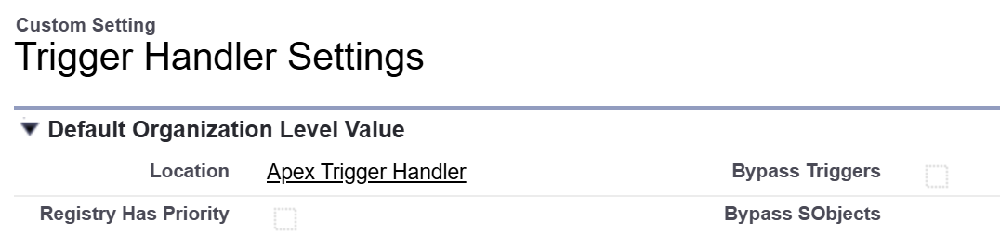

# Apex Trigger Handler

  

The Salesforce Apex trigger framework for clean, scalable, and maintainable automation.

### Features

1. Custom settings allow you to enable or disable triggers globally or for specific sObjects.
2. Custom registry lets you register handlers through configuration rather than code.
3. Fine-grained control over handler execution using `context.next()`, `context.stop()`, and `Triggers.skips`.

| Environment           | Installation Link                                                                                                                                         | Version |
| --------------------- | --------------------------------------------------------------------------------------------------------------------------------------------------------- | ------- |
| Production, Developer | <a target="_blank" href="https://login.salesforce.com/packaging/installPackage.apexp?p0=04tGC000007TPrTYAW"></a> | ver 2.0 |
| Sandbox               | <a target="_blank" href="https://test.salesforce.com/packaging/installPackage.apexp?p0=04tGC000007TPrTYAW"></a>  | ver 2.0 |

---

**Support:** If you find this library helpful, please consider sharing it on Twitter or recommending it to your friends and colleagues.

### Translations

- [简体中文](docs/README.zh-CN.md)

### Release v2.0

Completely rewritten from v1.0. Retains the best features, removes unnecessary complexity, and introduces new capabilities.

## Table of Contents

- [1. Setting](#1-setting)
  - [1.1 Custom Setting](#11-custom-setting)
  - [1.2 Custom Metadata](#12-custom-metadata)
- [2. Handler Registration](#2-handler-registration)
  - [2.1 Implementation](#21-implementation)
  - [2.2 Registering with Registry](#22-registering-with-registry)
  - [2.3 Registering with Apex](#23-registering-with-apex)
- [3. Handler Usage](#3-handler-usage)
  - [3.1 Props](#31-props)
  - [3.2 States](#32-states)
  - [3.3 Detecting Field Changes](#33-detecting-field-changes)
- [4. Execution Control](#4-execution-control)
  - [4.1 Skipping Handlers](#41-skipping-handlers)
  - [4.2 Handler Flow Control](#42-handler-flow-control)
  - [4.3 Error Handling](#43-error-handling)
- [5. Tests](#5-tests)
  - [5.1 Manipulating Settings](#51-manipulating-settings)
  - [5.2 Testing with Mock Data](#52-testing-with-mock-data)
- [6. APIs](#6-apis)
  - [6.1 Handler Interface](#61-handler-interface)
  - [6.2 Trigger Context](#62-trigger-context)
- [7. License](#7-license)

## 1. Setting

### 1.1 Custom Setting

<p align="center"></p>

The `Registry Has Priority` setting determines whether handlers registered via custom metadata types take precedence over those registered directly in Apex code. For more details about bypass flags, see the table below:

| Bypass Triggers | Bypass SObjects                       | Description                                                          |
| --------------- | ------------------------------------- | -------------------------------------------------------------------- |
| false           | Empty                                 | By default, no trigger handlers are bypassed.                        |
| true            | Empty                                 | All trigger handlers registered through this framework are bypassed. |
| true            | Account<br />Contact<br />Opportunity | Only trigger handlers for the specified SObjects are bypassed.       |

### 1.2 Custom Metadata

<p align="center"></p>

| Field Name      | Data Type | Description                                                                                                       |
| --------------- | --------- | ----------------------------------------------------------------------------------------------------------------- |
| SObject         | Text      | **Required.** The API name of the SObject to which the handler applies.                                           |
| Trigger Event   | Picklist  | **Required.** Defaults to `Any Event`. When set to `Any Event`, the handler is applied to all implemented events. |
| Handler Class   | Text      | **Required.** The name of the Apex class that implements the handler logic.                                       |
| Execution Order | Number    | **Required.** Determines the sequence in which handlers are executed.                                             |
| Is Active       | Checkbox  | Indicates whether the handler is enabled or disabled.                                                             |

## 2. Handler Registration

### 2.1 Implementation

To create a trigger handler, define a class that implements the corresponding handler interfaces.

```java
// Explicitly declare the required interfaces for clarity.
public class AccountTriggerHandler implements Triggers.BeforeInsert, Triggers.BeforeUpdate {
    // Implement Triggers.BeforeInsert
    public void beforeInsert(Triggers.Context context) {
    }

    // Implement Triggers.BeforeUpdate
    public void beforeUpdate(Triggers.Context context) {
    }
}
```

### 2.2 Registering with Registry

Handlers registered via the registry are loaded automatically. Each handler is associated with the correct SObject and trigger event based on its configuration.

<p align="center"></p>

```java
trigger AccountTrigger on Account (before update, after update) {
    Triggers.prepare().execute();
}
```

### 2.3 Registering with Apex

Handlers can be registered using either class types or class names. Using class names is often preferred for flexibility. You can bind handlers to all events for simpler control, or to specific events for more granular management.

```java
trigger AccountTrigger on Account (before update, after update) {
    Triggers.prepare()
        .bind(AccountTriggerHandler1.class) // handlers bound to any event
        .bind('AccountTriggerHandler2')
        .beforeUpdate()                     // handlers bound to a specific event
        .bind(AccountTriggerHandler3.class)
        .bind('AccountTriggerHandler4')
        .execute();
}
```

**Note:** You can register trigger handlers using both custom metadata and Apex code at the same time. By default, handlers registered in Apex code have higher priority. To give priority to handlers registered via custom metadata, enable the `Registry Has Priority` setting as described above.

## 3. Handler Usage

### 3.1 Props

All static properties from the `Trigger` class are now accessible via the `context` object. Always use `context` to access trigger properties, such as `context.oldList` and `context.newList`.

```java
public class AccountTriggerHandler implements Triggers.BeforeInsert {
    public void beforeInsert(Triggers.Context context) {
        if (context.isBefore && context.isInsert) {
            for (Account account : (List<Account>) context.newList) {
                // Your logic here
            }
        }
    }
}
```

### 3.2 States

Use `Triggers.states` to manage state objects. This is a singleton, meaning it is shared across all triggers within the same transaction. State classes are automatically initialized the first time they are accessed.

```java
public class AccountTriggerHandler implements Triggers.BeforeInsert {
    public void beforeInsert(Triggers.Context context) {
        // Retrieve and update a state instance as needed.
        CounterState counter = (CounterState) Triggers.states.get(CounterState.class);
        counter.increment();
    }
}
```

You can also set a state object in advance, which is useful for initializing values:

```java
// Make sure to check if the state already exists.`
if (!Triggers.states.contains(CounterState.class)) {
    Triggers.states.put(CounterState.class, new CounterState(100));
}
```

State classes must implement the `Triggers.State` interface.

```java
public class CounterState implements Triggers.State {
    public Integer count { get; private set; }

    public CounterState() {
        this.count = 0;
    }

    public CounterState(Integer count) {
        this.count = count;
    }

    public void increment() {
        this.count++;
    }
}
```

You can also remove state objects to free up resources:

```java
// Remove a specific state.
Triggers.states.remove(CounterState.class);
// Or clear all states.
Triggers.states.clear();
```

### 3.3 Detecting Field Changes

It is a common requirement to determine whether specific fields have changed between the old and new lists in a trigger context. You can use [Apex LINQ](https://github.com/apexfarm/ApexLINQ) to simplify this process.

```java
public class AccountTriggerHandler implements Triggers.BeforeUpdate {
    public void beforeUpdate(Triggers.Context context) {
        Q.Differ differ = new AccountDiffer();
        List<Account> changedAccounts = (List<Account>) Q.of(context.newList)
            .toDiff(differ, context.oldList);
        if (changedAccounts.isEmpty()) {
            return; // No relevant changes detected.
        }
        // Implement your business logic here.
    }

    public class AccountDiffer implements Q.Differ {
        public Boolean changed(Object fromRecord, Object toRecord) {
            Account fromAcc = (Account) fromRecord;
            Account toAcc = (Account) toRecord;
            return (Double) fromAcc.AnnualRevenue != (Double) toAcc.AnnualRevenue;
        }
    }
}
```

## 4. Execution Control

### 4.1 Skipping Handlers

You can skip specific handlers in your Apex code as shown below:

```java
// Skip the AccountTriggerHandler during this operation.
Triggers.skips.add(AccountTriggerHandler.class);
insert accounts;
// Restore the handler after the operation.
Triggers.skips.remove(AccountTriggerHandler.class);
// Or simply clear all skipped handlers.
Triggers.skips.clear();
```

| Method                         | Return Type | Description                           |
| ------------------------------ | ----------- | ------------------------------------- |
| `add(type handlerType)`        | void        | Skip a handler.                       |
| `add(List<type> handlerTypes)` | void        | Skip multiple handlers.               |
| `contains(type handlerType)`   | Boolean     | Check if a handler is being skipped.  |
| `remove(type handlerType)`     | void        | Restore a previously skipped handler. |
| `clear()`                      | void        | Restore all skipped handlers.         |

### 4.2 Handler Flow Control

```java
public class AccountTriggerHandler implements Triggers.BeforeInsert {
    public void beforeInsert(Triggers.Context context) {
        // Optionally call context.next() to execute all subsequent handlers.
        context.next();
        // This is useful if you need to perform logic after all subsequent handlers run.

        // Optionally call context.stop() to prevent any further handlers from executing.
        context.stop();
    }
}
```

### 4.3 Error Handling

You can centralize exception handling for all subsequent handlers by implementing a dedicated error handler. This ensures that any exceptions thrown by handlers executed after `context.next()` are caught and managed in a single location. For example:

```java
public class ErrorTriggerHandler implements Triggers.BeforeInsert, Triggers.AfterInsert {
    public void beforeInsert(Triggers.Context context) {
		execute(context);
    }

    public void afterInsert(Triggers.Context context) {
		execute(context);
    }

    private void execute(Triggers.Context context) {
        try {
            context.next();
        } catch (Exception ex) {
            // Handle exceptions from subsequent handlers here
            throw ex; // rethrow to revoke the transaction
        }
    }
}
```

## 5. Tests

### 5.1 Manipulating Settings

Settings can be modified for testing purposes only, as the following two methods are private and marked with `@TestVisible`.

```java
// Use this method to override the global settings.
// @param hasPriority
// @param bypassTriggers
// @param bypassSObjects
Triggers.setSettings(true, true, 'Account\nContact\nOpportunity');

// Use this method to override the handler registry.
Triggers.setRegistry(
    Account.SObjectType,
    new List<TriggerHandlerRegistry__mdt>{
        new TriggerHandlerRegistry__mdt(
            TriggerEvent__c = 'ANY_EVENT',
            HandlerClass__c = 'TriggersTest.AccountTriggerHandler01'
            // The following fields are optional:
            // SObject__c = 'Account',
            // ExecutionOrder__c = 10,
            // IsActive__c = true
        )
    }
);
```

### 5.2 Testing with Mock Data

The following method is private but marked as `@TestVisible`, allowing it to be used in test methods to provide mock records for the old and new lists. This eliminates the need to perform DML operations to trigger the handlers.

```java
@isTest
static void test_AccountTriggerHandler_BeforeUpdate {
    List<SObject> oldList = new List<Account> {
        new Account(Id = TriggersTest.getFakeId(Account.SObjectType, 1), Name = 'Old Name 1'),
        new Account(Id = TriggersTest.getFakeId(Account.SObjectType, 2), Name = 'Old Name 2'),
        new Account(Id = TriggersTest.getFakeId(Account.SObjectType, 3), Name = 'Old Name 3')}

    List<SObject> newList = new List<Account> {
        new Account(Id = TriggersTest.getFakeId(Account.SObjectType, 1), Name = 'New Name 1'),
        new Account(Id = TriggersTest.getFakeId(Account.SObjectType, 2), Name = 'New Name 2'),
        new Account(Id = TriggersTest.getFakeId(Account.SObjectType, 3), Name = 'New Name 3')}

    Triggers.prepare(TriggerOperation.Before_Update, oldList, newList)
        .beforeUpdate().bind('AccountTriggerHandler').execute();
}
```

## 6. APIs

### 6.1 Handler Interface

| Interface                 | Method to Implement                             |
| ------------------------- | ----------------------------------------------- |
| `Triggers.BeforeInsert`   | `void beforeInsert(Triggers.Context context);`  |
| `Triggers.AfterInsert`    | `void afterInsert(Triggers.Context context);`   |
| `Triggers.BeforeUpdate`   | `void beforeUpdate(Triggers.Context context);`  |
| `Triggers.AfterUpdate`    | `void afterUpdate(Triggers.Context context);`   |
| `Triggers.BeforeDelete`   | `void beforeDelete(Triggers.Context context);`  |
| `Triggers.AfterDelete`    | `void afterDelete(Triggers.Context context);`   |
| `Triggers.BeforeUndelete` | `void afterUndelete(Triggers.Context context);` |

### 6.2 Trigger Context

#### Properties

| Property                | Type               | Description              |
| ----------------------- | ------------------ | ------------------------ |
| `context.sObjectType`   | SObjectType        | The current SObjectType. |
| `context.isExecuting`   | Boolean            | Trigger.isExecuting      |
| `context.isBefore`      | Boolean            | Trigger.isBefore         |
| `context.isAfter`       | Boolean            | Trigger.isAfter          |
| `context.isInsert`      | Boolean            | Trigger.isInsert         |
| `context.isUpdate`      | Boolean            | Trigger.isUpdate         |
| `context.isDelete`      | Boolean            | Trigger.isDelete         |
| `context.isUndelete`    | Boolean            | Trigger.isUndelete       |
| `context.oldList`       | List\<SObject\>    | Trigger.old              |
| `context.oldMap`        | Map\<Id, SObject\> | Trigger.oldMap           |
| `context.newList`       | List\<SObject\>    | Trigger.new              |
| `context.newMap`        | Map\<Id, SObject\> | Trigger.newMap           |
| `context.operationType` | TriggerOperation   | Trigger.operationType    |
| `context.size`          | Integer            | Trigger.size             |

#### Methods

| Method           | Return Type | Description                                                                       |
| ---------------- | ----------- | --------------------------------------------------------------------------------- |
| `context.next()` | void        | Call the next handler.                                                            |
| `context.stop()` | void        | Stop execute any following handlers. A bit like the the stop in process builders. |

## 7. License

BSD 3-Clause License
