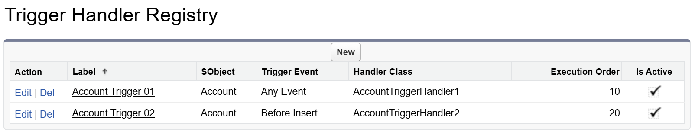

# Apex Trigger Handler

  

适用于 Salesforce 的 Apex 触发器框架，实现简洁、可扩展、易维护的自动化。

**支持：** 如果你觉得这个库有帮助，请考虑在朋友圈上分享，或推荐给你的朋友或同事。

### 功能特性

1. 自定义设置允许你全局或针对特定对象启用/禁用触发器。
2. 自定义注册表支持通过配置而非代码注册 Handler。
3. 通过 `context.next()`、`context.stop()` 和 `Triggers.skips` 精细控制 Handler 执行。

| 环境          | 安装链接                                                                                                                                             | 版本    |
| ------------- | ---------------------------------------------------------------------------------------------------------------------------------------------------- | ------- |
| 正式/开发环境 | <a target="_blank" href="https://login.salesforce.com/packaging/installPackage.apexp?p0=04tGC000007TPrTYAW"></a> | ver 2.0 |
| 沙盒环境      | <a target="_blank" href="https://test.salesforce.com/packaging/installPackage.apexp?p0=04tGC000007TPrTYAW"></a>  | ver 2.0 |

---

### 翻译

- [英语](../README.md)

### 版本 v2.0.0

从 v1.0 完全重写。保留最佳特性，去除不必要的复杂性，并引入新功能。

## 目录

- [1. 设置](#1-设置)
  - [1.1 自定义设置](#11-自定义设置)
  - [1.2 自定义元数据](#12-自定义元数据)
- [2. Handler](#2-handler)
  - [2.1 实现](#21-实现)
  - [2.2 注册到注册表](#22-注册到注册表)
  - [2.3 通过 Apex 注册](#23-通过-apex-注册)
  - [2.4 Props](#24-props)
  - [2.5 状态](#25-状态)
- [3. 执行控制](#3-执行控制)
  - [3.1 跳过 Handler](#31-跳过-handler)
  - [3.2 Handler 流程控制](#32-handler-流程控制)
  - [3.3 错误处理](#33-错误处理)
- [4. 测试](#4-测试)
  - [4.1 设置操作](#41-设置操作)
  - [4.2 使用模拟数据测试](#42-使用模拟数据测试)
- [5. API](#5-api)
  - [5.1 Handler 接口](#51-handler-接口)
  - [5.2 触发器上下文](#52-触发器上下文)
- [6. 许可证](#6-许可证)

## 1. 设置

### 1.1 自定义设置


`Registry Has Priority` 设置决定通过自定义元数据类型注册的 Handler 是否优先于直接在 Apex 代码中注册的 Handler。有关 `Bypass` 标志的更多信息，请参见下表：

| Bypass Triggers | Bypass SObjects                       | 说明                              |
| --------------- | ------------------------------------- | --------------------------------- |
| false           | 空                                    | 默认情况下，不跳过任何 Handler。  |
| true            | 空                                    | 框架注册的所有 Handler 都被跳过。 |
| true            | Account<br />Contact<br />Opportunity | 仅跳过指定对象的 Handler。        |

### 1.2 自定义元数据



| 字段名          | 数据类型 | 说明                                                                                 |
| --------------- | -------- | ------------------------------------------------------------------------------------ |
| SObject         | 文本     | **必填。** Handler 适用的 SObject API 名称。                                         |
| Trigger Event   | 选项集   | **必填。** 默认为 `Any Event`，设置为 `Any Event` 时，Handler 应用于所有已实现事件。 |
| Handler Class   | 文本     | **必填。** 实现 Handler 逻辑的 Apex 类名。                                           |
| Execution Order | 数字     | **必填。** 决定 Handler 的执行顺序。                                                 |
| Is Active       | 复选框   | 指示 Handler 是否启用。                                                              |

## 2. Handler

### 2.1 实现

要创建触发器 Handler，定义一个实现相应接口的类。

```java
// 明确声明所需接口，便于理解。
public class AccountTriggerHandler implements Triggers.BeforeInsert, Triggers.BeforeUpdate {
    // 实现 Triggers.BeforeInsert
    public void beforeInsert(Triggers.Context context) {
    }

    // 实现 Triggers.BeforeUpdate
    public void beforeUpdate(Triggers.Context context) {
    }
}
```

### 2.2 注册到注册表

通过注册表注册的 Handler 会自动加载。每个 Handler 根据配置与正确的 SObject 和触发事件关联。


```java
trigger AccountTrigger on Account (before update, after update) {
    Triggers.prepare().execute();
}
```

### 2.3 通过 Apex 注册

Handler 可以通过类类型或类名注册。推荐使用类名注册以获得更高灵活性。你可以将 Handler 绑定到所有事件，或绑定到特定事件以实现更细粒度的控制。

```java
trigger AccountTrigger on Account (before update, after update) {
    Triggers.prepare()
        .bind(AccountTriggerHandler1.class) // 绑定到所有事件
        .bind('AccountTriggerHandler2')
        .beforeUpdate()                     // 绑定到特定事件
        .bind(AccountTriggerHandler3.class)
        .bind('AccountTriggerHandler4')
        .execute();
}
```

**注意：** 你可以同时通过自定义元数据和 Apex 代码注册 Handler。默认情况下，Apex 代码注册的 Handler 优先生效。如需让自定义元数据注册的 Handler 优先，请启用上述的 `Registry Has Priority` 设置。

### 2.4 Props

所有 Trigger 静态属性现在都可通过 `context` 对象访问。请始终使用 `context` 访问触发器属性，如 `context.oldList` 和 `context.newList`。

```java
public class AccountTriggerHandler implements Triggers.BeforeInsert {
    public void beforeInsert(Triggers.Context context) {
        if (context.isBefore && context.isInsert) {
            for (Account account : (List<Account>) context.newList) {
                // 你的逻辑
            }
        }
    }
}
```

### 2.5 状态

使用 `Triggers.states` 管理状态对象。该对象为单例，在同一事务内被所有触发器共享。状态类首次访问时会自动初始化。

```java
public class AccountTriggerHandler implements Triggers.BeforeInsert {
    public void beforeInsert(Triggers.Context context) {
        // 获取并更新状态实例
        CounterState counter = (CounterState) Triggers.states.get(CounterState.class);
        counter.increase();
    }
}
```

你也可以提前设置状态对象，适合初始化值：

```java
// 请确保状态尚未存在
if (!Triggers.states.contains(CounterState.class)) {
    Triggers.states.put(CounterState.class, new CounterState(100));
}
```

状态类必须实现 `Triggers.State` 接口。

```java
public class CounterState implements Triggers.State {
    public Integer count { get; private set; }

    public CounterState() {
        this.count = 0;
    }

    public CounterState(Integer count) {
        this.count = count;
    }

    public void increase() {
        this.count++;
    }
}
```

你也可以移除状态对象以释放资源：

```java
// 移除指定状态
Triggers.states.remove(CounterState.class);
// 或清空所有状态
Triggers.states.clear();
```

## 3. 执行控制

### 3.1 跳过 Handler

你可以在 Apex 代码中跳过特定 Handler：

```java
// 跳过 AccountTriggerHandler
Triggers.skips.add(AccountTriggerHandler.class);
insert accounts;
// 恢复 Handler
Triggers.skips.remove(AccountTriggerHandler.class);
// 或清空所有跳过的 Handler
Triggers.skips.clear();
```

| 方法                           | 返回类型 | 说明                 |
| ------------------------------ | -------- | -------------------- |
| `add(type handlerType)`        | void     | 跳过一个 Handler     |
| `add(List<type> handlerTypes)` | void     | 跳过多个 Handler     |
| `contains(type handlerType)`   | Boolean  | 检查是否被跳过       |
| `remove(type handlerType)`     | void     | 恢复被跳过的 Handler |
| `clear()`                      | void     | 恢复所有 Handler     |

### 3.2 Handler 流程控制

```java
public class AccountTriggerHandler implements Triggers.BeforeInsert {
    public void beforeInsert(Triggers.Context context) {
        // 可选调用 context.next() 执行后续所有 Handler
        context.next();
        // 适用于需要在所有后续 Handler 执行后再处理逻辑的场景

        // 可选调用 context.stop() 阻止后续 Handler 执行
        context.stop();
    }
}
```

### 3.3 错误处理

你可以通过实现专用 Handler 集中处理所有后续 Handler 的异常。例如：

```java
public class ErrorTriggerHandler implements Triggers.BeforeInsert, Triggers.AfterInsert {
    public void beforeInsert(Triggers.Context context) {
        execute(context);
    }

    public void afterInsert(Triggers.Context context) {
        execute(context);
    }

    private void execute(Triggers.Context context) {
        try {
            context.next();
        } catch (Exception ex) {
            // 统一处理后续 Handler 抛出的异常
            throw ex; // 重新抛出以撤销事务
        }
    }
}
```

## 4. 测试

### 4.1 设置操作

为测试开发的设置修改方法，以下两个方法为私有并标记为 `@TestVisible`。

```java
// 用于覆盖全局设置
// @param hasPriority
// @param bypassTriggers
// @param bypassSObjects
Triggers.setSettings(true, true, 'Account\nContact\nOpportunity');

// 用于覆盖注册表
Triggers.setRegistry(
    Account.SObjectType,
    new List<TriggerHandlerRegistry__mdt>{
        new TriggerHandlerRegistry__mdt(
            TriggerEvent__c = 'ANY_EVENT',
            HandlerClass__c = 'TriggersTest.AccountTriggerHandler01'
            // 以下字段可选：
            // SObject__c = 'Account',
            // ExecutionOrder__c = 10,
            // IsActive__c = true
        )
    }
);
```

### 4.2 使用模拟数据测试

以下方法为私有但标记为 `@TestVisible`，可在测试方法中使用模拟记录，无需 DML 操作即可触发 Handler。

```java
@isTest
static void test_AccountTriggerHandler_BeforeUpdate {
    List<SObject> oldList = new List<Account> {
        new Account(Id = TriggersTest.getFakeId(Account.SObjectType, 1), Name = 'Old Name 1'),
        new Account(Id = TriggersTest.getFakeId(Account.SObjectType, 2), Name = 'Old Name 2'),
        new Account(Id = TriggersTest.getFakeId(Account.SObjectType, 3), Name = 'Old Name 3')}

    List<SObject> newList = new List<Account> {
        new Account(Id = TriggersTest.getFakeId(Account.SObjectType, 1), Name = 'New Name 1'),
        new Account(Id = TriggersTest.getFakeId(Account.SObjectType, 2), Name = 'New Name 2'),
        new Account(Id = TriggersTest.getFakeId(Account.SObjectType, 3), Name = 'New Name 3')}

    Triggers.prepare(TriggerOperation.Before_Update, oldList, newList)
        .beforeUpdate().bind('AccountTriggerHandler').execute();
}
```

## 5. API

### 5.1 Handler 接口

| 接口                      | 需实现方法                                      |
| ------------------------- | ----------------------------------------------- |
| `Triggers.BeforeInsert`   | `void beforeInsert(Triggers.Context context);`  |
| `Triggers.AfterInsert`    | `void afterInsert(Triggers.Context context);`   |
| `Triggers.BeforeUpdate`   | `void beforeUpdate(Triggers.Context context);`  |
| `Triggers.AfterUpdate`    | `void afterUpdate(Triggers.Context context);`   |
| `Triggers.BeforeDelete`   | `void beforeDelete(Triggers.Context context);`  |
| `Triggers.AfterDelete`    | `void afterDelete(Triggers.Context context);`   |
| `Triggers.BeforeUndelete` | `void afterUndelete(Triggers.Context context);` |

### 5.2 触发器上下文

#### 属性

| 属性                    | 类型             | 说明                  |
| ----------------------- | ---------------- | --------------------- |
| `context.sObjectType`   | SObjectType      | 当前 SObjectType      |
| `context.isExecuting`   | Boolean          | Trigger.isExecuting   |
| `context.isBefore`      | Boolean          | Trigger.isBefore      |
| `context.isAfter`       | Boolean          | Trigger.isAfter       |
| `context.isInsert`      | Boolean          | Trigger.isInsert      |
| `context.isUpdate`      | Boolean          | Trigger.isUpdate      |
| `context.isDelete`      | Boolean          | Trigger.isDelete      |
| `context.isUndelete`    | Boolean          | Trigger.isUndelete    |
| `context.oldList`       | List<SObject>    | Trigger.old           |
| `context.oldMap`        | Map<Id, SObject> | Trigger.oldMap        |
| `context.newList`       | List<SObject>    | Trigger.new           |
| `context.newMap`        | Map<Id, SObject> | Trigger.newMap        |
| `context.operationType` | TriggerOperation | Trigger.operationType |
| `context.size`          | Integer          | Trigger.size          |

#### 方法

| 方法             | 返回类型 | 说明                                        |
| ---------------- | -------- | ------------------------------------------- |
| `context.next()` | void     | 执行下一个 Handler                          |
| `context.stop()` | void     | 停止执行后续 Handler，类似流程构建器的 stop |

## 6. 许可证

BSD 3-Clause License
